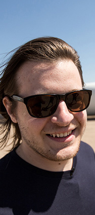
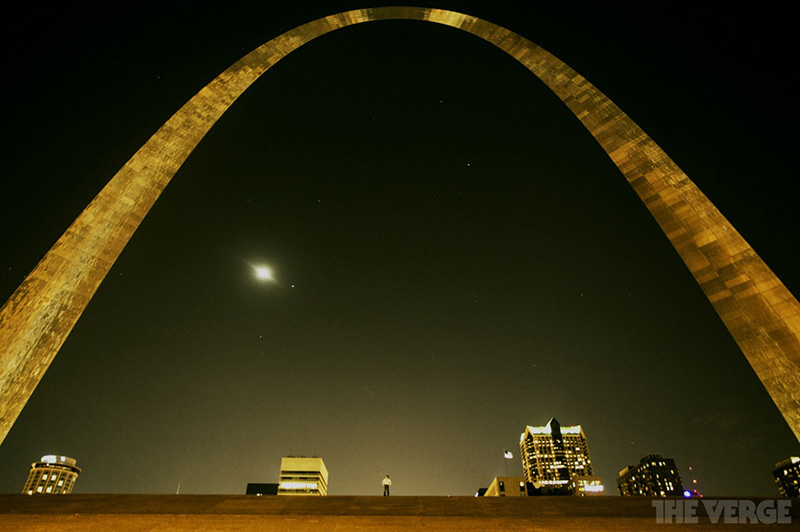

# Я всё ещё здесь: возвращение в Cеть после года без Интернета

Я был неправ.

Год назад я покинул Интернет. Я думал, что он пагубно влияет на мою продуктивность. Я думал, что ему не хватает смысла. Я думал, что он "развращал мою душу".

Уже год прошёл с тех пор, как я "сёрфил по Сети" или "проверял почту" или "лайкал" что-либо в фигуральном смысле заместо обычного "пальца вверх". Я научился оставаться отключённым, как и планировал, я свободен от Интернета.

Теперь я собираюсь рассказать вам, как всё это решило мои проблемы. Я собирался быть просвещённым, более "реальным". Более совершенным.

На самом деле сейчас 8 вечера, и я только проснулся. Я спал весь день, проснулся с восемью сообщениями на голосовой почте от друзей и коллег. Я пошёл в своё обычное кафе за обедом, игрой Knicks, двумя моими газетами и копией The New Yorker. А сейчас я смотрю "Историю игрушек", попутно уставившись и моргая на мигающий курсор в этом текстовом документе, надеясь, что он напишет себя сам, сгенерирует те прозрения моей жизни, которых я не смог достичь.

Я не хотел встречать такого Пола в конце моего годового путешествия.

В начале 2012-го мне было 26 лет, и я выдохся. Я хотел вырваться из современной жизни — бесконечного цикла входящих e-mail'ов, непрекращающегося потока информации из Всемирной паутины, заглушающего моё здравомыслие. Я хотел сбежать.

Я думал, что Интернет может быть неестесственным состоянием для нас, людей, или по крайней мере для меня. Может, я был слишком зависим, чтобы справиться, или слишком импульсивен, чтобы ограничить себя. Я постоянно пользовался Интернетом с 12-ти лет и не представлял своей жизни без него с 14-ти. Я прошёл путь от разносчика газет до веб-дизайнера, а затем до технологического писателя (*technology writer*) меньше чем за 10 лет. Я жил с ощущением непрерывности подключения и бесконечности информации. Мне было интересно, что ещё жизнь может предложить. "Реальная жизнь", если можно так выразиться, ждала меня с другой стороны веб-браузера.

Моим планом было уйти с работы, переехать в дом своих родителей, читать книги, писать книги и валяться на диване в перерывах. Одним махом я бы преодолел все подступающие ко мне кризисы. Я бы нашёл настоящего Пола где-то далеко за гранью шума и стал бы лучшей версией себя.

Но по некоторым причинам *The Verge* хотела *заплатить* мне за уход из Интернета. Я мог остаться в Нью-Йорке и делиться своими открытиями с миром, транслировать свою свободную от Интернета жизнь жителям Сети, которую я оставил позади, делиться мудростью со своей высокой башни.

Моей целью как технологического писателя было узнать, что сделал со мной Интернет за все эти годы. Понять Интернет, изучая его "на расстоянии". Я бы не просто стал лучшим человеком, я бы помог всем нам стать лучшими людьми. Как только мы поймём, как Интернет развращает нас, мы наконец-то сможем противостать этому.

В 23:59, 30 апреля 2012 г. я выдернул свой Ethernet-кабель, отключил Wi-Fi и сменил смарфтон на простую "звонилку". Это было действительно хорошее чувство. Я ощущал свободу.

Несколько недель спустя я обнаружил себя в толпе с 60 000 ультраортодоксальных евреев, набившихся на городскую поляну Нью-Йорка, чтобы познать опасности Интернета от самого уважаемого в мире раввина. Серьёзно. За пределами стадиона меня заметил человек, размахивающий одной из моих статей об уходе из Интернета. Он был в восторге от встречи со мной. Я принял решение уйти из Интернета по многим причинам, схожим с его религией, выражавшей опасения о современном мире.

"Он перепрограммирует наши взаимоотношения, наши эмоции и нашу чувствительность," - сказал один из раввинов. - "Он уничтожает наше терпение. Он превращает детей в кликающие овощи".

Это должно было быть потрясающе.

  

## Мне снился сон

Всё начиналось прекрасно, скажу я вам. Я действительно ограничил себя и нюхал цветочки. Моя жизнь была полна незапланированных событий: встреч, фризби, велопоездок и греческой литературы. Без чёткого понимания того, как это у меня получилось, я написал половину своего романа и практически каждую неделю отправлял эссе в *the Verge*. В один из первых месяцев мой босс выразил легкое разочарование по поводу того, *сколько я писал*, чего никогда не случилось ни ранее, ни с тех пор.

Я потерял 15 фунтов веса без каких-либо усилий. Купил новую одежду. Люди продолжали говорить мне, как хорошо я выглядел, каким счастливым я смотрелся. Во время одного из осмотров мой терапевт буквально сам похлопал себя по плечу.

Я был немного скучающим, немного одиноким, но я обнаружил чудесные изменения в своей жизни. В августе я написал: "Скука и недостаток мотивации принуждают меня делать вещи, которые действительно для меня важны, например, писательство или проведение времени с другими людьми". Я был полностью уверен, что у меня всё под контролем, и всем об этом говорил.

После того, как моя голова очистилась, повысилась устойчивость внимания. В мой первый или второй месяц, 10 страниц "Одиссеи" были каторгой. Теперь я могу прочитать 100 страниц в один присест, а если читается легко и я увлечён, то и несколько сотен.

Я научился воспринимать идеи, для которых мало поста в блог, но достаточно изложения размером с роман. Вырвавшись из безэховой камеры Интернет-культуры, я обнаружил, что мои идеи развиваются в новых направлениях. Я ощущал себя по-другому, немного эксцентрично, и мне это нравилось.

Избавившись от любимого смартфона, я был вынужден вылезать из скорлупы в сложных социальных ситуациях. Оказывается, без своей постоянной рассеянности я был более внимателен к другим людях. Я больше не мог поддерживать взаимоотношения в Твиттере - я должен был найти их в реальной жизни. Моя сестра, ранее тщетно пытавшаяся поговорить со мной, пока я слушал её лишь наполовину, теперь обожает наши разговоры. Она говорит, что я менее отстранён эмоционально и больше забочусь о её состоянии - в общем, я стал в меньшей степени кретином, чем был.

К тому же, не знаю, как соотнести это с остальным, но я плакал во время просмотра <a href="http://www.kinopoisk.ru/level/1/film/566055">"Отверженных"</a>.

 В те первые несколько месяцев казалось, что моя гипотеза подтвердилась. Интернет удерживал меня от истинного себя, лучшего Пола. Я воткнул вилку в розетку и зажёг свет.

  

## Суровая реальность

Когда я покинул Интернет, я думал, что мои журнальные статьи будут чем-то вроде "Я использовал бумажную карту сегодня, и это было ржачно!" или "Бумажные книги? Это что такое?!" или "У кого-нибудь есть скачанная Википедия погонять?". Этого не произошло.

По большей части практические аспекты этого года прошли незамеченными. У меня не было проблем с ориентированием по Нью-Йорку, а в других местах я покупал бумажные карты. Оказалось, что бумажные книги действительно хороши. Я не сравнивал цены на билеты, а просто звонил в Delta и брал то, что они предлагали.

В общем-то, большинству вещей, которым я учился, можно научиться как с Интернетом, так и без него - не нужно садиться на годовую Интернет-диету, чтобы осознать, что у твоей сестры есть чувства.

Большой переменой стала "обычная" почта. В этом году я завёл почтовый ящик 
(*P.O. Box*), и я не могу передать, сколько радости мне он приносил мне, будучи забитым письмами от читателей. Это нечто ощутимое, и такое не передать электронной открыткой.

Очаровательным, аккуратным почерком одна девушка написала на настоящем листе бумаги: "Спасибо, что ушёл из Интернета". Не как оскорбление, а как комплимент. Это письмо очень много для меня значило.

Но потом я почувствовал себя плохо, потому что никогда не писал ответных писем.

И тогда, по некоторым причинам, даже походы на почту стали для меня работой. Я начал бояться писем и уже был готов отсылать их назад.

Как оказалось, дюжина писем в неделю по тяжести нагрузки сравнима с сотней e-mail'ов в день. И так всё происходило в большинстве сфер моей жизни. Хорошая книга требовала мотивации для чтения независимо от того, есть у меня Интернет в качестве альтернативы или нет. Выход из дома для встречи с людьми требовал ровно столько же смелости, сколько и обычно.

На заре 2012-го я научился принимать неправильные решения по-новому, без Интернета. Я забросил свои хорошие привычки и нашёл новые пороки. Вместо того, чтобы превращать скуку и недостаток мотивации в обучение и креативность, я обратился на сторону пассивного потребления и социального отшельничества.

В новом году я уже не катаюсь на велосипеде так часто. Мой фризби собирает пыль. Неделями я не встречаюсь с людьми. Моё любимое место - диван. Я закидываю ноги на кофейный столик, играю в видеоигру и слушаю аудиокнигу. Выбираю какую-нибудь бессмысленную игру вроде *Borderlands 2* или *Skate 3*, в то время как мой мозг релаксирует под аудиокнигу или просто тишину.

## Люди, которые нуждаются в других

Итак, моральные выборы не так уж и изменились с отсутствием Интернета. К практическим вещам вроде карт и шопинга не так уж сложно привыкнуть. Люди всё ещё рады указать вам правильное направление. Но без Интернета стало действительно сложно искать людей. Сделать телефонный звонок труднее, чем послать e-mail. Легче послать SMS или встретиться в видеочате, чем приехать к кому-то домой. Не то чтобы эти препятствия непреодолимы. Я преодолевал их в начале, но не смог довести начатое до конца.

Трудно сказать, что на самом деле изменилось. Думаю, те первые месяцы были так хороши потому, что я чувствовал отсутствие давления со стороны Интернета. Моя свобода была ощутима. Но когда я перестал смотреть на свою жизнь в контексте "я не пользуюсь Интернетом", существование вне Сети стало рутинным, и начали проявляться мои худшие стороны.

Я мог сидеть дома по несколько дней в то время. Мой телефон мог разрядиться, и никто не мог со мной связаться. В какой-то момент родителям надоедало гадать, жив я или уже нет, и они посылали сестру ко мне домой. В Интернете было легко убедить людей в том, что я жив-здоров, было легко взаимодействовать с коллегами, быть значимой частью общества.

Столько было исписано страниц, высмеивающих ложный концепт "друга на Facebook", но я могу сказать вам, что "друг на Facebook" лучше, чем ничего.

Мой лучший "друг на расстоянии", единственный, с которым я созванивался каждую неделю на протяжении многих лет, переехал в Китай в этом году, и с тех пор я больше с ним не разговаривал. Мой лучший друг, живущий в Нью-Йорке, просто растворился в своей работе, в то время как я не смог уследить за крахом наших планов.

Я выпал из жизненного потока.

В марте этого года я по иронии судьбы посетил конференцию в Нью-Йорке под названием "Теоретизируя Всемирную паутину". Она была полна аспирантов и прочих учёных, выступающих со сложными докладами об определении реальности, о том, как выглядит феминизм в пост-цифровой эре и прочих подобных вещах. Поначалу я был немного самодоволен, потому что думал, что они имеют дело только с теориями, подразумевавшими, что Интернет был во всём, в то время как я познавал обособленную жизнь.

Но после я поговорил с Нэйтаном Юргенсоном (*Nathan Jurgenson*), теоретиком, помогавшим организовать конференцию. Он обратил внимание на то, что в виртуальном есть много "реального", и в реальном полно "виртуального". Когда мы используем телефон или компьютер, мы всё ещё люди из плоти и крови, занимающие пространство и время. Когда мы скачем где-нибудь в поле, отбросив куда-нибудь далеко свои гаджеты, Интернет всё ещё влияет на наше мышление: "Твитну ли я об этом, когда вернусь?".

Моим планом было оставить Интернет и таким образом найти "настоящего" Пола, войти в контакт с "реальным" миром, но настоящий Пол и реальный мир уже неразделимо связаны с Интернетом. Я не к тому, что моя жизнь не изменилась с отказом от Интернета, а к тому, что это не была настоящая жизнь.

## Семейное время

Пару недель назад я поехал в Колорадо, чтобы увидеться со своим братом до того, как его перебросят в Катар вместе с ВВС. У него был маленький ребёнок, пятимесячная полнощёчка по имени Касия (*Kacia*), которую я видел только на фотографиях, любезно высланных по почте моей золовкой.

Я провёл с братом один день и на следующее утро поехал с ним в аэропорт. Ошарашенный, я смотрел, как он целует на прощание свою жену и детей. Несправедливо, что ему нужно было уезжать. Он являлся героем для своих детей, и я ненавидел тот факт, что ему придется покинуть их на 6 месяцев.

Мои коллеги Джордан и Стефан встретили меня в Колорадо, чтобы отправиться в дорожное путешествие назад, в Нью-Йорк. Идея была в том, чтобы сжать весь мой год в маленький документальный фильм и провести часы в дороге за обсуждением того, что со мной произошло и что может произойти позже.

Прежде чем мы уехали, я провёл ещё немного времени с детьми, стараясь изо всех сил помочь своей золовке, быть супер-дядей. Потом нам нужно было уезжать.

В дороге Джордан и Стефан задавали мне вопросы. "Как думаешь, ты был слишком строг к себе?" - "Да". "Был ли этот год успешным?" - "Нет". "Чем ты хочешь заниматься, когда вернёшься в Интернет?" - "Хочу стараться для других людей".

Мы сделали остановку в Хантингтоне, Западная Вирджиния, чтобы встретиться с моим героем, Джастином МакЭлроем (*Justin McElroy*) из <a href="http://www.polygon.com/">Polygon</a>. Я встречался с Нэйтаном Юргенсоном в Вашингтоне. Я много думал о том, мог бы я преуспеть в Сети в тех вещах, в которых потерпел поражение вне её. Я просил совета.

Что я точно знаю, так это то, что я не могу винить Интернет, или любые обстоятельства в моих проблемах. У меня сохранились многие из моих приоритетов, которые я имел до ухода: семья, друзья, работа, обучение. У меня нет гарантии, что я буду придерживаться их по возвращении - скорее всего, не буду, если быть честным. Но по крайней мере я буду знать, что Интернет не виноват. Я буду знать, кто за всё отвечает и кто может всё исправить.

Во вторник, в последнюю ночь нашего путешествия мы остановились возле реки, текущей из Нью-Йорка, чтобы сделать снимок Манхэттеновского горизонта из Нью-Джерси. Это была холодная, ясная ночь, я прислонился к хлипким перилам моста и пытался принять удобную позу для снимка. Я был так близок к Нью-Йорку, так близок к завершению. Я тосковал по спокойному одиночеству своей квартиры и немного боялся возвращаться к изоляции.

Через две недели я вернусь в Интернет. Я чувствовал поражение. Чувствовал, будто я вновь опускал руки. Но я знал, что Интернет - это место, где я должен быть.

## 12:00, 1 мая 2013 г.

Я прочитал столько постов в блогах, журнальных статей и книг о том, что Интернет делает нас одинокими, или глупыми, или глупыми и одинокими сразу, что начал им верить. Я хотел выяснить, что Интернет "делал со мной", чтобы я мог противостоять. Но Интернет - это не индивидуальная гонка, это что-то, что мы делаем *вместе, друг с другом*. Интернет там, где люди.

В мой последний день в Колорадо я сел рядом со своей пятилетней племянницей Казайей (*Keziah, ох уж эти имена - прим. пер.*) и попробовал объяснять ей, что такое Интернет. Она никогда о нём не слышала, но зато много общается в Скайпе со своими бабушками и дедушками. Я спросил, не интересовалась ли она, почему я не звонил ей в Скайпе в этом году. Она интересовалась.

"Я думала, ты просто не хотел," - сказала она.

Со слезами на глазах я нарисовал ей, что такое Интернет. Нарисовал компьютеры, телефоны и телевизоры с тонкими линиями, соединяющими их. "Эти линии - Интернет". Я показал ей мой компьютер, нарисовал к нему линию и стёр её.

"Я прожил год, не используя Интернет," - сказал я ей. - "Но сейчас я возвращаюсь назад и смогу звонить тебе снова".

Когда я вернусь в Интернет, я, возможно, не буду использовать его правильно. Возможно, я буду тратить время, отвлекаться или кликать не по тем ссылкам. У меня не будет столько времени для чтения, самопознания или написания великого американского фантастического романа.

Но по крайней мере я буду на связи.